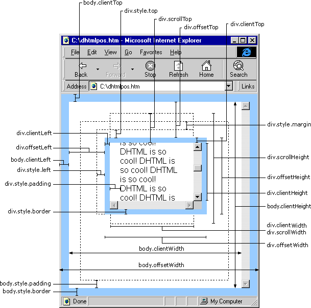

##组件介绍
基于jQuery实现自定义滚动条效果。
在线演示[http://hawuji.github.io/js-demos/jQuery-scroll/](http://hawuji.github.io/js-demos/jQuery-scroll/)

##参数配置
```js
scrollDir: "y", // 滚动的方向
contSelector: "", // 滚动内容区选择器
barSelector: "", // 滚动条选择器
sliderSelector: "", // 滚动滑块选择器
tabItemSelector: "", // 标签选择器
tabActiveClass: "", // 选中时标签类名
anchorSelector: "", // 锚点选择器
wheelStep: 10, // 滚轮步长
correctSelector: "", //校正元素
articleSelector: "" // 文章选择器
```
##知识点
1. 组件封装的思想
2. 鼠标拖动事件处理
3. 鼠标滚轮事件处理
4. 链式调用

##关键词
1. extend
2. pageX , pageY：显示鼠标指针的位置
3. scrollTop：返回或设置匹配元素的滚动条的垂直位置
4. scrollLeft：设置或返回匹配元素相对滚动条左侧的偏移
5. scrollHeight：对象的实际内容的高度
6. scrollWidth：对象的实际内容的宽度
4. Firefox滚轮事件：DOMMouseScroll,其他浏览器：mousewheel
5. Firefox滚轮事件属性：detail,其他浏览器：wheeldelta
6. Firefox属性取值±3，其他浏览器取值±120
7. Firefox中负数表示向上，其他浏览器正数表示向上


